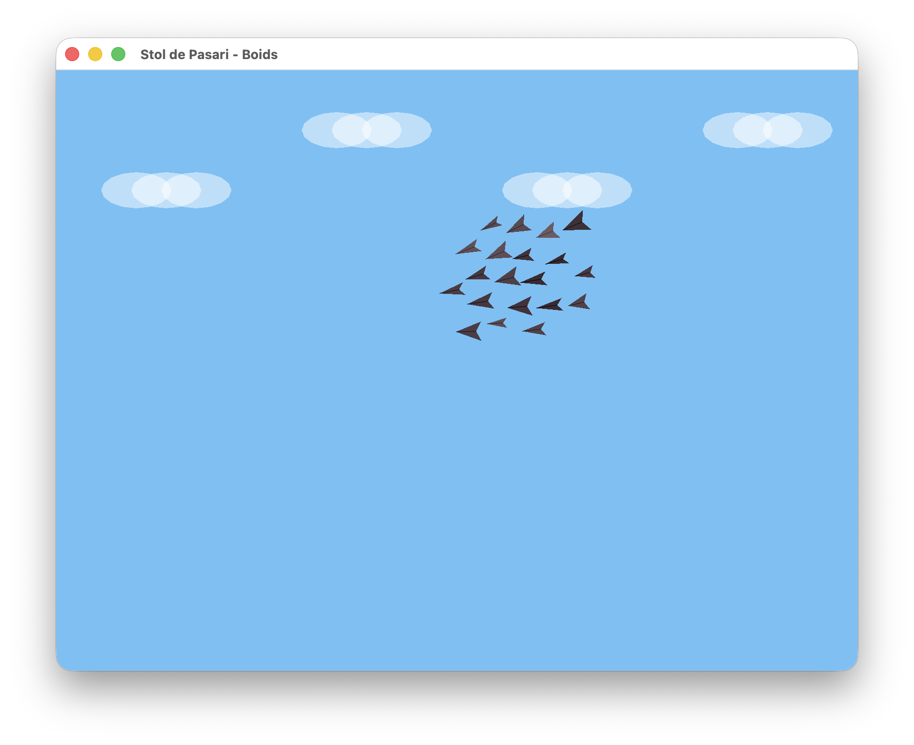

# Stol de Păsări - Simulare Boids
## Autor Andrei Demit
---

# Proiect de grafică pe calculator - Simulare Boids

## Descriere Generală

Acest proiect implementează o simulare vizuală a unui stol de păsări folosind **algoritmul Boids**, dezvoltat inițial de Craig Reynolds în 1986. Algoritmul simulează comportamentul colectiv al păsărilor (sau al altor entități care se deplasează în grup) prin aplicarea a trei reguli simple fiecărui individ:

1. **Separare** - evitarea coliziunilor cu vecinii apropiați
2. **Aliniere** - potrivirea direcției de zbor cu vecinii
3. **Coeziune** - deplasarea spre centrul de masă al grupului

Proiectul folosește **OpenGL** pentru randare grafică, **GLFW** pentru gestionarea ferestrei și a input-ului, și **GLEW** pentru extensiile OpenGL.

---

## Conceptul Proiectului

Conceptul fundamental al acestei aplicații este **"Emergența"** (Emergence) — ideea că un comportament complex și organizat poate rezulta din interacțiunea unor entități simple care urmează reguli locale, fără a exista un coordonator central.

În contextul graficii pe calculator, proiectul demonstrează cum matematica vectorială și transformările geometrice pot fi utilizate pentru a da viață unor forme statice. Fiecare "boid" (pasăre) este un agent autonom care percepe mediul înconjurător și reacționează în timp real, creând iluzia unui organism unic, fluid.

## Transformări Geometrice Utilizate

Pentru realizarea scenei și a animației, au fost implementate următoarele transformări grafice fundamentale, aplicate în pipeline-ul de randare (în `render.cpp`):

1.  **Translație (`glTranslated`)**:
    *   Utilizată pentru a poziționa fiecare pasăre la coordonatele `(x, y)` calculate de motorul fizic.
    *   Utilizată pentru poziționarea norilor decorativi pe cer.

2.  **Rotație (`glRotated`)**:
    *   Esențială pentru orientarea păsării. Se calculează unghiul vectorului de viteză (`atan2`), iar sistemul de coordonate local al păsării este rotit astfel încât aceasta să "privească" în direcția de deplasare.

3.  **Scalare (`glScaled`)**:
    *   Aplicată pentru a varia dimensiunea păsărilor (între 0.8x și 1.1x), oferind diversitate vizuală stolului și simulând distanțe diferite sau vârste diferite ale indivizilor.

4.  **Transformări de Modelare (Shape Modeling)**:
    *   Geometria păsării este definită relativ la origine `(0,0)`. Prin modificarea coordonatelor vârfurilor în timp real (bazat pe funcția `sin` pentru `wingPhase`), se realizează transformarea de formă care simulează bătaia aripilor.

5.  **Proiecție Ortografică (`glOrtho`)**:
    *   Mapează spațiul virtual 2D la coordonatele pixelilor ferestrei, asigurând că proporțiile obiectelor se păstrează indiferent de poziție.

## De ce este original?

Deși algoritmul Boids este un standard în domeniu, această implementare se distinge prin:

1.  **Interactivitate Directă**: Utilizatorul nu este doar un spectator; prin click-ul mouse-ului, acesta devine un "magnet" pentru stol, influențând dinamic traiectoria grupului și forțând recalcularea priorităților (coezine vs. atracție țintă).
2.  **Estetică Procedurală**: Păsările nu sunt sprite-uri statice, ci forme geometrice desenate procedural. Animația aripilor nu este un loop pre-înregistrat, ci este calculată matematic în funcție de viteza individuală a fiecărei păsări.
3.  **Detaliu Ambiental**: Adăugarea elementelor de fundal (nori transparenți cu blending) și a variațiilor de culoare/dimensiune per individ sparge monotonia vizuală specifică simulărilor algoritmice brute.
4.  **Fizică Hibridă**: Combină regulile de comportament de grup cu fizica newtoniană (inerție, frecare/drag), rezultând o mișcare mult mai organică și mai puțin "robotică".

---

## Structura Proiectului

```
src/
├── main.cpp        # Punctul de intrare în aplicație
├── config.h        # Constante și parametri de configurare
├── pasare.h        # Structura de date pentru o pasăre
├── globals.h       # Declarații variabile globale (extern)
├── globals.cpp     # Definiții variabile globale
├── boids.h         # Declarații funcții algoritm Boids
├── boids.cpp       # Implementare algoritm Boids
├── render.h        # Declarații funcții de desenare
├── render.cpp      # Implementare funcții de desenare
├── input.h         # Declarații callback-uri input
├── input.cpp       # Implementare callback-uri input
├── init.h          # Declarații funcții de inițializare
├── init.cpp        # Implementare funcții de inițializare
└── Makefile        # Sistem de compilare
```

---

## Descrierea Fișierelor Sursă

### `main.cpp` - Punctul de Intrare

Acest fișier conține funcția `main()` care reprezintă punctul de intrare al aplicației. Responsabilitățile sale includ:

- **Inițializarea GLFW** - biblioteca pentru crearea ferestrei și gestionarea evenimentelor
- **Crearea ferestrei** - o fereastră de 800x600 pixeli cu titlul "Stol de Pasari - Boids"
- **Inițializarea GLEW** - pentru accesul la extensiile OpenGL moderne
- **Înregistrarea callback-urilor** - conectează funcțiile de input (mouse și tastatură)
- **Bucla principală de joc (Game Loop)** - repetă până la închiderea ferestrei:
  1. Șterge ecranul
  2. Actualizează pozițiile păsărilor (`actualizeaza()`)
  3. Desenează scena (`desenareStol()`)
  4. Schimbă buffer-ele (double buffering)
  5. Procesează evenimentele de input

---

### `config.h` - Configurare și Constante

Fișier header care definește toate constantele utilizate în simulare. Modificarea acestor valori permite ajustarea comportamentului stolului fără a modifica logica programului.

#### Constante definite:

| Constantă | Valoare | Descriere |
|-----------|---------|-----------|
| `NUM_PASARI` | 20 | Numărul total de păsări din simulare |
| `PI` | 3.14159... | Constanta matematică π |
| `MAX_SPEED` | 4.0 | Viteza maximă a unei păsări (pixeli/frame) |
| `SEPARATION_RADIUS` | 25.0 | Distanța sub care se activează separarea |
| `SEPARATION_WEIGHT` | 1.8 | Intensitatea forței de separare |
| `ALIGNMENT_RADIUS` | 50.0 | Distanța pentru calculul alinierii |
| `ALIGNMENT_WEIGHT` | 1.0 | Intensitatea forței de aliniere |
| `COHESION_RADIUS` | 80.0 | Distanța pentru calculul coeziunii |
| `COHESION_WEIGHT` | 1.0 | Intensitatea forței de coeziune |
| `EDGE_MARGIN` | 60.0 | Distanța de la margine unde începe respingerea |
| `EDGE_FORCE` | 0.3 | Intensitatea forței de evitare a marginilor |
| `MOUSE_ATTRACTION` | 0.015 | Cât de puternic atrage click-ul mouse-ului |
| `DRAG` | 0.97 | Factor de fricțiune (încetinire graduală) |
| `WINDOW_WIDTH` | 800 | Lățimea ferestrei în pixeli |
| `WINDOW_HEIGHT` | 600 | Înălțimea ferestrei în pixeli |

---

### `pasare.h` - Structura Pasăre

Definește structura de date `Pasare` care reprezintă o singură pasăre din stol.

#### Câmpuri ale structurii:

| Câmp | Tip | Descriere |
|------|-----|-----------|
| `x, y` | `GLdouble` | Poziția absolută pe ecran (coordonate în pixeli) |
| `vx, vy` | `GLdouble` | Componentele vitezei pe axele X și Y |
| `ax, ay` | `GLdouble` | Componentele accelerației (forțele Boids acumulate) |
| `angle` | `GLdouble` | Unghiul de orientare în radiani (direcția de zbor) |
| `wingPhase` | `GLdouble` | Faza curentă a animației aripilor (0 - 2π) |
| `wingSpeed` | `GLdouble` | Viteza de bătaie a aripilor (variază per pasăre) |
| `size` | `GLdouble` | Factorul de scalare (dimensiunea relativă) |
| `r, g, b` | `GLfloat` | Componentele culorii RGB (nuanțe de gri-maro) |

---

### `globals.h` / `globals.cpp` - Variabile Globale

#### `globals.h`
Declară variabilele globale folosind cuvântul cheie `extern`, permițând accesul din orice fișier sursă care include acest header.

#### `globals.cpp`
Definește (alocă memorie pentru) variabilele globale:

- **`pasari[NUM_PASARI]`** - Array-ul cu toate păsările din simulare
- **`targetX, targetY`** - Coordonatele punctului de atracție (setat prin click)

Separarea declarațiilor (`extern`) de definiții previne erorile de "multiple definition" la link-editare.

---

### `boids.h` / `boids.cpp` - Algoritmul Boids

Implementează logica principală a simulării - algoritmul Boids.

#### Funcții:

##### `double distanta(double x1, double y1, double x2, double y2)`
Calculează distanța Euclidiană între două puncte folosind formula:
$$d = \sqrt{(x_2-x_1)^2 + (y_2-y_1)^2}$$

##### `void calculeazaForteBoids(int idx)`
Calculează toate forțele care acționează asupra păsării cu indexul `idx`:

1. **Separare (Separation)**
   - Iterează prin toți vecinii din raza `SEPARATION_RADIUS`
   - Calculează un vector de respingere proporțional invers cu distanța
   - Previne suprapunerea păsărilor

2. **Aliniere (Alignment)**
   - Calculează viteza medie a vecinilor din raza `ALIGNMENT_RADIUS`
   - Ajustează direcția păsării curente spre media grupului
   - Creează mișcarea coordonată a stolului

3. **Coeziune (Cohesion)**
   - Calculează centrul de masă al vecinilor din raza `COHESION_RADIUS`
   - Generează o forță de atracție spre acest centru
   - Menține stolul unit

4. **Evitare Margini**
   - Aplică forțe de respingere când pasărea se apropie de marginile ferestrei
   - Previne ieșirea păsărilor din zona vizibilă

5. **Atracție Mouse**
   - Aplică o forță slabă spre punctul `targetX, targetY`
   - Permite utilizatorului să ghideze stolul

##### `void actualizeaza()`
Bucla de actualizare pentru toate păsările. Pentru fiecare pasăre:

1. Calculează forțele Boids (`calculeazaForteBoids`)
2. Actualizează viteza: $v = v + a$
3. Aplică fricțiunea: $v = v \times DRAG$
4. Limitează viteza la `MAX_SPEED`
5. Actualizează poziția: $p = p + v$
6. Rotește pasărea lin spre direcția de mișcare (interpolare)
7. Animează aripile în funcție de viteză

---

### `render.h` / `render.cpp` - Randare Grafică

Implementează funcțiile de desenare folosind OpenGL în mod imediat (immediate mode).

#### Funcții:

##### `void desenarePasare(Pasare& p)`
Desenează o singură pasăre ca un triunghi stilizat (formă de săgeată/avion):

1. **Transformări geometrice:**
   - `glTranslated` - mută originea la poziția păsării
   - `glRotated` - rotește după unghiul de orientare
   - `glScaled` - scalează după dimensiunea individuală

2. **Animația aripilor:**
   - Lățimea triunghiului variază sinusoidal cu `wingPhase`
   - Formula: $width = 8 + \sin(wingPhase) \times 2$

3. **Geometria păsării:**
   - Două triunghiuri care formează o săgeată
   - Scobitura din spate creează aspectul de "V"
   - Linie mediană pentru detaliu vizual

##### `void desenareStol()`
Desenează întreaga scenă:

1. **Nori decorativi:**
   - 4 grupuri de nori albi semi-transparenți
   - Fiecare nor = 3 elipse suprapuse
   - Poziționați în partea superioară a ecranului

2. **Păsările:**
   - Desenate de la ultima spre prima (Z-order)
   - Asigură că păsările "din față" sunt vizibile

---

### `input.h` / `input.cpp` - Gestionarea Input-ului

Implementează callback-urile pentru interacțiunea cu utilizatorul.

#### Funcții:

##### `void mouse_button_callback(GLFWwindow* window, int button, int action, int mods)`
Apelată automat de GLFW când utilizatorul apasă un buton al mouse-ului:

- Obține poziția cursorului cu `glfwGetCursorPos`
- Inversează coordonata Y (OpenGL are originea jos-stânga)
- Setează `targetX` și `targetY` la noua poziție
- Stolul va fi atras încet spre acest punct

##### `void key_callback(GLFWwindow* window, int key, int scancode, int action, int mods)`
Apelată automat când utilizatorul apasă o tastă:

- **Tasta R** - resetează stolul la poziții aleatorii (apelează `initPasari()`)

---

### `init.h` / `init.cpp` - Inițializare

Funcții pentru configurarea inițială a simulării.

#### Funcții:

##### `void initPasari()`
Inițializează toate păsările cu valori aleatorii:

- **Poziție:** zonă centrală (200-600, 150-450)
- **Viteză:** direcție predominant spre dreapta (-45° la +45°)
- **Animație aripi:** faze diferite pentru varietate vizuală
- **Dimensiune:** variații mici (0.8 - 1.1)
- **Culoare:** nuanțe de gri-maro (aspect natural)

##### `void init()`
Configurează OpenGL și inițializează simularea:

1. **Culoare fundal:** albastru-cer (0.5, 0.75, 0.95)
2. **Proiecție ortografică:** 800x600, coordonate în pixeli
3. **Blending:** activat pentru transparență (nori)
4. **Antialiasing:** linii netede
5. Apelează `initPasari()` pentru a crea stolul

---

### `Makefile` - Sistem de Compilare

Script pentru compilarea automată a proiectului pe macOS.

#### Comenzi disponibile:

| Comandă | Descriere |
|---------|-----------|
| `make` sau `make all` | Compilează proiectul |
| `make run` | Compilează și rulează |
| `make clean` | Șterge fișierele compilate |

#### Configurație:

- **Compilator:** g++ cu C++11
- **Flags:** -Wall -Wextra (avertismente complete)
- **Include:** /opt/homebrew/include (Homebrew pe Apple Silicon)
- **Biblioteci:** GLFW, GLEW, OpenGL.framework

---

## Controlul Aplicației

| Acțiune | Efect |
|---------|-------|
| **Click mouse** | Setează un punct de atracție pentru stol |
| **Tasta R** | Resetează stolul la poziții aleatorii |
| **Închide fereastra** | Termină aplicația |

---

## Concepte Tehnice Utilizate

### Algoritmul Boids
Simulare emergentă - comportament complex din reguli simple. Fiecare pasăre "decide" individual, dar rezultatul colectiv pare coordonat.

### Double Buffering
Tehnica de randare cu două buffer-e pentru a evita flickering-ul. Se desenează într-un buffer ascuns, apoi se face swap.

### Immediate Mode OpenGL
Metodă clasică de desenare cu `glBegin/glEnd`. Simplă dar mai puțin eficientă decât VBO-urile moderne.

### Interpolare Unghiulară
Rotirea lină a păsărilor folosind interpolare liniară pe unghi, cu normalizare pentru a evita salturile la trecerea 180°/-180°.

---

## Compilare și Rulare

### Cerințe:
- macOS cu Xcode Command Line Tools
- Homebrew
- GLFW și GLEW (`brew install glfw glew`)

### Comenzi:
```bash
cd src
make run
```

---

## Capturi de Ecran

### 1. Cod Sursă (Fragment din `boids.cpp`)
*Implementarea regulilor de separare și aliniere care guvernează stolul.*


### 2. Rezultatul Simulării
*Stolul de păsări formând un grup coeziv, cu nori în fundal și variații de orientare.*


